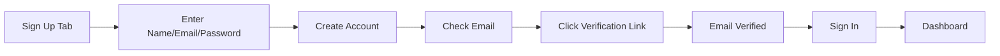
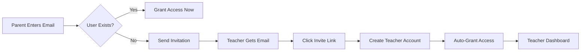
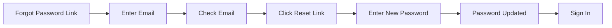
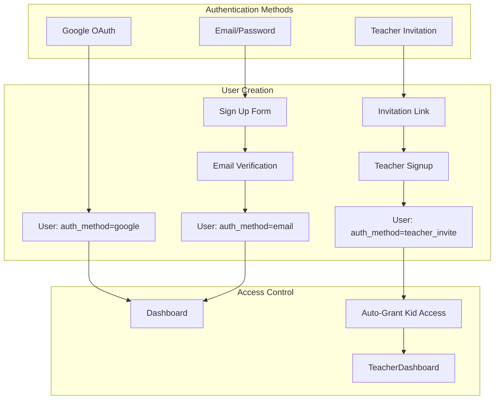

# Phase 3B: Dual Authentication System - COMPLETE ✅

## Overview

Phase 3B adds email/password authentication alongside Google OAuth and implements a teacher invitation system. This enables users who don't want to use Google accounts and streamlines teacher onboarding.

## Key Features Implemented

### 1. Dual Authentication System

**Both authentication methods work side-by-side:**
- Google OAuth (existing - unchanged)
- Email/Password (new)

**Authentication UI** ([`auth.html`](auth.html))
- Tabbed interface: Sign In / Sign Up
- Google OAuth button in both tabs
- Email/password forms with validation
- "OR" divider for clear UX
- Forgot password link
- Password confirmation in signup

**Authentication Logic** ([`auth.js`](auth.js))
- `signUpWithEmail()` - Create account with email/password
- `signInWithEmail()` - Sign in with credentials  
- `requestPasswordReset()` - Send reset link via email
- `switchTab()` - Toggle between sign in/sign up
- Email verification requirement enforced
- Password minimum 8 characters

### 2. Email Verification System

**Email Verification Page** ([`verify-email.html`](verify-email.html))
- Automatic email verification handling
- Success/error states with visual feedback
- Redirects to sign in after successful verification
- Updates `email_verified` flag in database
- Clean, user-friendly interface

**Verification Flow:**
1. User signs up with email/password
2. Supabase sends verification email automatically
3. User clicks link in email
4. Lands on verify-email.html
5. Email confirmed automatically
6. Redirects to sign in

### 3. Password Reset System

**Password Reset Page** ([`reset-password.html`](reset-password.html))
- Secure password reset form
- Password confirmation validation
- Minimum 8 characters enforced
- Uses Supabase Auth password reset
- Success/error messaging
- Auto-redirect to sign in after reset

**Reset Flow:**
1. User clicks "Forgot password?" on sign in page
2. Enters email address
3. Supabase sends reset email
4. User clicks link in email
5. Lands on reset-password.html
6. Enters new password
7. Password updated via Supabase Auth

### 4. Teacher Invitation System

**Complete invitation workflow for frictionless teacher onboarding:**

**Parent Side** ([`kid-access-management.js`](kid-access-management.js))
- Enter teacher email to grant access
- If teacher exists → Grant immediately
- If teacher doesn't exist → Send invitation
- Displays pending invitations with status
- Can cancel pending invitations
- 7-day expiration on invitations
- Secure token generation (32-byte cryptographic)

**Teacher Side** ([`teacher-invite.html`](teacher-invite.html) / [`teacher-invite.js`](teacher-invite.js))
- Click invitation link from email
- See who invited them and for which kid
- Create account with name and password
- Email field pre-filled (read-only)
- Auto-verified (no email verification needed)
- Auto-granted kid access permissions
- Auto-granted teacher-dashboard app access
- Auto-redirected to teacher dashboard
- Graceful handling of expired/invalid invitations

**Email Function** ([`netlify/functions/send-invitation.js`](netlify/functions/send-invitation.js))
- Netlify serverless function
- Generates invitation email
- Returns URL for manual sharing (development mode)
- Ready for email service integration (SendGrid/Mailgun)
- Includes HTML email template

## Database Schema

**File:** `database-phase3b-auth.sql`

### Users Table Updates
```sql
-- Made google_id optional (was NOT NULL)
ALTER TABLE users ALTER COLUMN google_id DROP NOT NULL;

-- New columns:
- password_hash TEXT (Supabase Auth manages this)
- auth_method TEXT ('google', 'email', 'teacher_invite')
- email_verified BOOLEAN
- email_verification_token TEXT
- email_verification_expires TIMESTAMP
- password_reset_token TEXT
- password_reset_expires TIMESTAMP
```

### Teacher Invitations Table
```sql
CREATE TABLE teacher_invitations (
    id UUID PRIMARY KEY,
    invited_by UUID REFERENCES users(id),
    kid_id UUID REFERENCES kids(id),
    email TEXT NOT NULL,
    token TEXT UNIQUE NOT NULL,
    access_level TEXT,
    status TEXT ('pending', 'accepted', 'expired', 'cancelled'),
    expires_at TIMESTAMP NOT NULL,
    accepted_at TIMESTAMP
);
```

### RLS Policies
- Parents can view/create/update their own invitations
- Anyone can read invitations by token (safe - tokens are unguessable)
- Invitation status workflow enforced

## User Flows

### Flow 1: Regular User Signup


### Flow 2: Teacher Invitation


### Flow 3: Password Reset


## Security Model

### Authentication Methods
- **Google OAuth**: Email verified by Google, `auth_method = 'google'`
- **Email/Password**: Must verify email, `auth_method = 'email'`
- **Teacher Invite**: Auto-verified (trusted), `auth_method = 'teacher_invite'`

### Password Security
- Minimum 8 characters enforced
- Bcrypt hashing (handled by Supabase Auth)
- Secure password reset via email link
- Password confirmation required

### Invitation Security
- 32-byte cryptographic tokens (unguessable)
- 7-day expiration enforced
- One-time use (status → 'accepted')
- Parent-controlled (parent creates invitation)
- RLS policies restrict who can create/view

## Migration & Compatibility

### Existing Users
- ✅ Google OAuth users continue working unchanged
- ✅ All existing users auto-marked as `auth_method = 'google'`
- ✅ All existing users auto-marked as `email_verified = true`
- ✅ No action required from existing users

### Protected Pages
- ✅ All existing pages work with both auth methods
- ✅ Supabase `auth.getUser()` handles both transparently
- ✅ No changes needed to dashboard, kid-prefs, etc.

## Files Created/Modified

### New Files:
- `database-phase3b-auth.sql` - Schema updates
- `verify-email.html` - Email verification page
- `reset-password.html` - Password reset page
- `teacher-invite.html` - Invitation landing page
- `teacher-invite.js` - Invitation acceptance logic
- `netlify/functions/send-invitation.js` - Email function

### Modified Files:
- `auth.html` - Added email forms and tabs
- `auth.js` - Added email auth functions
- `kid-access-management.js` - Added invitation logic

## Deployment Steps

### 1. Run Database Migration
```sql
-- In Supabase SQL Editor:
database-phase3b-auth.sql
```

### 2. Configure Supabase Email Settings (Optional but Recommended)

**In Supabase Dashboard:**
1. Go to Authentication → Email Templates
2. Customize:
   - Confirm signup email
   - Reset password email
   - Change email confirmation
3. Configure SMTP (optional - Supabase provides built-in email)

### 3. Deploy to Netlify
- Git push triggers auto-deploy
- Netlify function automatically deployed

### 4. Configure Email Service (Production)

**Option A: SendGrid** (Recommended - 100 free/day)
```bash
# In Netlify Environment Variables:
SENDGRID_API_KEY=your_key_here
```

**Option B: Mailgun** (10,000 free/month)
```bash
MAILGUN_API_KEY=your_key_here
MAILGUN_DOMAIN=your_domain_here
```

**For Development:**
- Function returns invitation URL in response
- Parent can manually share link with teacher
- Email sending can be added later

## Testing Checklist

### Email/Password Auth:
- [ ] Sign up with new email
- [ ] Receive verification email
- [ ] Click verification link
- [ ] Sign in with email/password
- [ ] Request password reset
- [ ] Receive reset email
- [ ] Reset password successfully
- [ ] Sign in with new password

### Google OAuth:
- [ ] Verify Google sign in still works
- [ ] Existing Google users can still sign in
- [ ] New users can sign up with Google
- [ ] No disruption to existing functionality

### Teacher Invitation:
- [ ] Parent invites non-existent teacher email
- [ ] Invitation created in database
- [ ] Netlify function called (check logs)
- [ ] Teacher accesses invitation URL
- [ ] Teacher sees correct kid name and inviter
- [ ] Teacher creates account
- [ ] Account auto-verified (email_verified = true)
- [ ] user_type auto-set to 'teacher'
- [ ] Kid access auto-granted
- [ ] Teacher-dashboard app access auto-granted
- [ ] Teacher redirected to dashboard
- [ ] Teacher can see the kid
- [ ] Invitation marked as 'accepted'

### Edge Cases:
- [ ] Expired invitation shows error
- [ ] Invalid token shows error
- [ ] Duplicate email signup shows error
- [ ] Already granted access shows message
- [ ] Cancelled invitation not accessible

## Known Limitations

1. **Email Service Not Configured**
   - Invitation URLs returned in API response
   - Parents must manually share links
   - Production needs SendGrid/Mailgun integration

2. **Supabase Email Templates**
   - Using default Supabase email templates
   - Can be customized in Supabase Dashboard
   - May go to spam (need SMTP or custom domain)

## Next Steps (Optional Enhancements)

1. **Email Service Integration**
   - Add SendGrid API key to Netlify
   - Update send-invitation.js to actually send emails
   - Customize email templates

2. **Invitation Management UI**
   - View all sent invitations (across all kids)
   - Resend expired invitations
   - Bulk invite multiple teachers

3. **Teacher Request Flow**
   - Teachers can request access
   - Parents approve/deny from dashboard
   - Notifications for new requests

4. **Email Notifications**
   - Notify teacher when access granted
   - Notify parent when teacher accepts invite
   - Notify when observations are added

## Architecture Diagram



## Status

**Phase 3B: COMPLETE** ✅
- Part 1: Dual authentication UI ✅
- Part 2: Teacher invitation system ✅
- Part 3: Email service (pending configuration)

**Platform Progress:**
- ✅ Phase 1: Platform Foundation
- ✅ Phase 2: Built-in Preferences Manager
- ✅ Phase 3B: Dual Authentication System
- ✅ Phase 4: Kid Preferences Tracking
- ✅ Phase 5: Teacher Access & Collaboration
- ⏳ Phase 3A: Recommendations Engine (optional)

## Impact

**For Parents:**
- Can invite teachers without requiring Google accounts
- Teachers get seamless onboarding experience
- No manual setup or configuration needed

**For Teachers:**
- One-click signup from invitation
- No Google account required
- Immediate access to kid preferences
- Professional email-based workflow

**For Everyone:**
- More authentication options
- Better privacy (don't need Google)
- More secure (email verification)
- Password recovery available

The platform now supports three authentication methods and provides a professional teacher invitation workflow! 🎉
